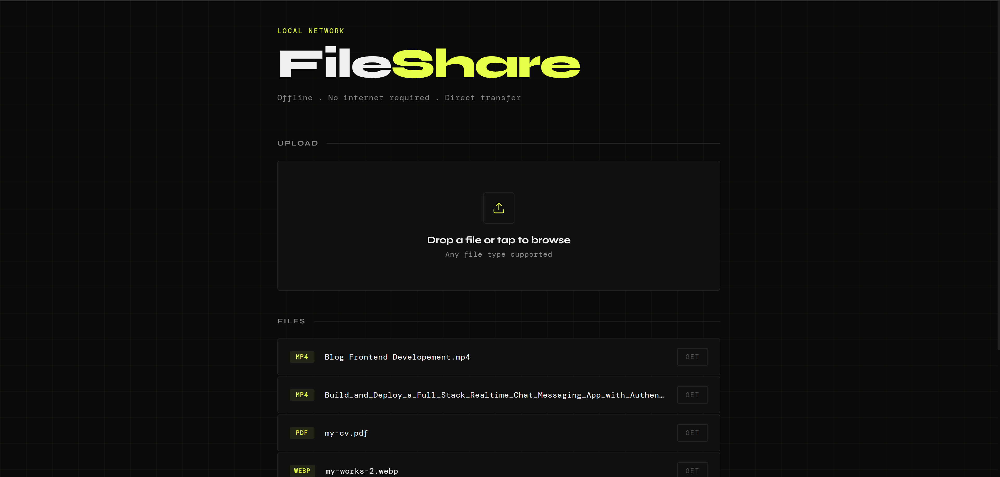
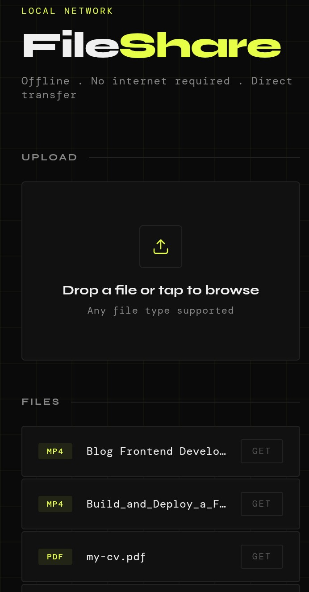

# FileShare

A lightweight, offline file sharing tool that runs between your phone and laptop over a local hotspot — no internet, no cables, no third-party apps.

Built with Python and a single HTML file.

---

**Desktop view**



**Mobile view**



---

## How It Works

Your laptop runs a local HTTP server. Your phone connects to the laptop's hotspot and accesses the server through a browser. Files can be sent in both directions — upload from phone to laptop, download from laptop to phone.

No data is sent over the internet. Everything stays between your two devices.

---

## Requirements

- Python 3.13+
- A laptop running Windows, macOS, or Linux
- Any phone with a browser

---

## Setup

**1. Clone or download the project**

```
git clone https://github.com/yourname/fileshare
cd fileshare
```

Or just download and unzip the folder manually.

**2. Run the server**

```
python server.py
```

You should see:
```
Server running on Port 8080
```

**3. Create a hotspot on your laptop**

On Windows: Settings → Network & Internet → Mobile Hotspot → Turn on

**4. Connect your phone to the hotspot**

Use the hotspot name and password shown in your laptop's hotspot settings.

**5. Find your laptop's local IP**

Open Command Prompt and run:
```
ipconfig
```
Look for the IP address under your hotspot adapter, usually something like `192.168.137.1`.

**6. Open the interface on your phone**

In your phone's browser, go to:
```
http://192.168.137.1:8080
```

You should see the FileShare interface.

---

## Features

- Upload files from phone to laptop
- Download files from laptop to phone
- Drag and drop support on desktop
- Real-time upload progress bar
- Video streaming with seek support
- Multithreaded — handles multiple connections simultaneously
- No install required on phone, just a browser

---

## Project Structure

```
fileshare/
├── server.py       — Python HTTP server
├── index.html      — Web interface
├── uploads/        — Uploaded files are saved here (auto-created)
└── README.md
```

---


## Limitations

- Both devices must be connected to the same hotspot
- The server runs only while the terminal is open
- Designed for local use only — do not expose to public networks

---

## License

MIT — do whatever you want with it.